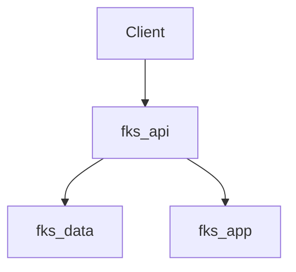

# FKS Documentation Style Guide

**Version**: 1.0  
**Last Updated**: 2025-01-15  
**Purpose**: Ensure consistent, professional documentation across all FKS docs

---

## 📝 General Principles

1. **Clarity First**: Write for your future self and new contributors
2. **Be Concise**: Get to the point quickly, avoid unnecessary verbosity
3. **Stay Current**: Update docs when code changes
4. **Use Examples**: Show, don't just tell

---

## 📐 Formatting Standards

### Headers

- Use `#` for document title (H1) - only one per file
- Use `##` for major sections (H2)
- Use `###` for subsections (H3)
- Use `####` for sub-subsections (H4)
- Don't skip levels (e.g., don't go from H2 to H4)

**Good**:
```markdown
# Service Architecture

## Overview
### Components
#### Database Layer
```

**Bad**:
```markdown
# Service Architecture
#### Database Layer  # Skipped H2 and H3
```

### Lists

- Use `-` for unordered lists
- Use `1.` for ordered lists
- Indent nested lists with 2 spaces
- Add blank line before lists

**Good**:
```markdown
The service includes:

- Database layer
  - PostgreSQL
  - Redis cache
- API layer
  - REST endpoints
  - GraphQL queries
```

### Code Blocks

- Always specify language for syntax highlighting
- Use triple backticks with language identifier
- Include context in comments when helpful

**Good**:
```python
# Load configuration from central config
from fks_config import load_config

config = load_config("/app/config/services/fks_app.yaml")
```

**Bad**:
```
load config
```

### Links

- Use descriptive link text
- Prefer relative paths for internal links
- Include `.md` extension for clarity

**Good**:
```markdown
See [Architecture Guide](architecture/AI_ARCHITECTURE.md) for details.
```

**Bad**:
```markdown
See [here](architecture/AI_ARCHITECTURE.md).
```

---

## ✍️ Writing Style

### Tone

- **Professional but approachable**: Not overly formal, but not casual
- **Active voice**: Prefer "The service processes requests" over "Requests are processed by the service"
- **Direct**: Say what you mean clearly

### Terminology

- **FKS**: Always capitalize (not "fks" or "Fks")
- **Service names**: Use format `fks_<service>` (e.g., `fks_app`, `fks_data`)
- **Ports**: Always include port number (e.g., "port 8002")
- **URLs**: Use full URLs with protocol (e.g., `http://fks_app:8002`)

### Common Phrases

| Use | Avoid |
|-----|-------|
| "The service" | "It" (when ambiguous) |
| "For example" | "e.g." (in formal docs) |
| "That is" | "i.e." (in formal docs) |
| "Note that" | "NB" or "N.B." |

---

## 📋 Document Structure

### Standard Sections

Every guide should include:

1. **Title** (H1)
2. **Metadata** (date, version, status)
3. **Overview/Introduction** (H2)
4. **Main Content** (H2 sections)
5. **Examples** (H2)
6. **Related Documents** (H2)
7. **Last Updated** (footer)

### Example Template

```markdown
# Document Title

**Date**: YYYY-MM-DD  
**Version**: 1.0  
**Status**: ✅ Complete / 🟡 In Progress / ⚪ Planned

---

## Overview

Brief description of what this document covers.

---

## Main Section

Content here.

---

## Examples

### Example 1

```python
# Code example
```

---

## Related Documents

- [Related Doc 1](path/to/doc1.md)
- [Related Doc 2](path/to/doc2.md)

---

**Last Updated**: YYYY-MM-DD
```

---

## 🎨 Visual Elements

### Diagrams

- Use Mermaid for flowcharts and diagrams
- Include alt text descriptions
- Keep diagrams simple and focused

**Example**:


### Tables

- Use tables for structured data
- Include headers
- Align columns appropriately

**Example**:
| Service | Port | Status |
|---------|------|---------|
| fks_web | 8000 | ✅ Active |
| fks_api | 8001 | ✅ Active |

### Status Indicators

- ✅ Complete / Active / Success
- 🟡 In Progress / Warning
- ⚪ Planned / Pending
- ❌ Failed / Deprecated

---

## 🔍 Quality Checklist

Before committing documentation:

- [ ] Spell-checked (use tool or manual review)
- [ ] Grammar checked
- [ ] Links validated (no broken links)
- [ ] Code examples tested
- [ ] Headers follow hierarchy
- [ ] Consistent terminology
- [ ] Date/version updated
- [ ] Related docs linked

---

## 🛠️ Tools

### Linting

- **Markdownlint**: Enforces formatting rules
- **Vale**: Advanced style checking
- **Grammarly**: Grammar and clarity

### Generation

- **MkDocs**: Static site generation
- **Mermaid**: Diagram generation
- **Pandoc**: Format conversion

---

## 📚 References

- [Markdown Guide](https://www.markdownguide.org/)
- [Google Style Guide](https://google.github.io/styleguide/docguide/best_practices.html)
- [Write the Docs](https://www.writethedocs.org/guide/)

---

**Last Updated**: 2025-01-15

