# 🚦 FKS Architecture Evolution - What to Do NOW vs LATER

**Created**: October 18, 2025  
**Status**: Action Plan - START HERE

---

## ⚡ TL;DR - The Smart Path Forward

**Your DDD research is excellent, but WRONG TIMING.**

### Do This First (Next 4 Weeks):
1. ✅ Fix broken imports (Issue #48) - **1-2 days**
2. ✅ Implement RAG tasks (Issue #49) - **1-2 weeks**  
3. ✅ Replace mock data (Issue #39) - **2-3 days**
4. ✅ Expand test coverage (Issue #41) - **1 week**

### Do This Later (Week 8+):
- 📋 DDD refactoring (see `ARCHITECTURE_REFACTORING_PLAN.md`)
- 📋 Domain-driven restructuring
- 📋 Polyrepo considerations

---

## 🎯 Why "Fix First, Refactor Later" is Critical

### The Trap You're About To Fall Into

```python
# Scenario: You start DDD refactoring NOW

# Day 1: Move files
git mv src/trading/signals/ apps/trading/services/
# Result: 200+ import errors

# Day 2-3: Fix imports
sed -i 's/from src.trading/from apps.trading/g' **/*.py
# Result: Still 50+ errors (circular deps, config issues)

# Day 4-5: Debug mysterious failures
pytest tests/ -v
# Result: 8/34 tests passing (was 14/34 - got WORSE!)

# Day 6-10: Panic mode
# You're now fixing:
# - Import errors from restructuring
# - Import errors from legacy config (Issue #48)  
# - Stub implementations (Issue #49)
# - Mock data inconsistencies (Issue #39)
# ALL AT THE SAME TIME

# Week 2: Burnout
# Project is less functional than when you started
# You've wasted 2 weeks moving broken code around
```

**This is EXACTLY what happens when you refactor before stabilizing.**

---

## ✅ The Right Sequence: Progressive Enhancement

### Phase 1: Make It Work (Weeks 1-4) 🔴 START HERE

**Goal**: Working trading system with real data and passing tests

```mermaid
graph TD
    A[Fix Imports Issue 48] -->|14/34 → 34/34 tests| B[Implement RAG Tasks Issue 49]
    B -->|Stubs → Real logic| C[Replace Mock Data Issue 39]
    C -->|Fake → Real queries| D[Expand Coverage Issue 41]
    D -->|41% → 80% coverage| E[STABLE BASELINE]
    
    style E fill:#00ff00
```



**Deliverables**:
- ✅ All tests passing (34/34)
- ✅ RAG generates real signals
- ✅ UI shows live trading data
- ✅ 80%+ test coverage
- ✅ **You can safely refactor after this**

### Phase 2: Make It Right (Weeks 5-6) 🟡 THEN DO THIS

**Goal**: Production deployment and monitoring

```bash
# Week 5: Deploy to staging
docker-compose up --build
# Test with real Binance data
# Monitor with Grafana

# Week 6: Optimize performance
# Issue #43: Update dependencies
# Issue #44: Add async support
# Issue #45: Runtime security
```

**Deliverables**:
- ✅ Production deployment
- ✅ 2 weeks of stable trading
- ✅ Performance baselines
- ✅ Security hardened

### Phase 3: Make It Beautiful (Weeks 7-12) 🟢 FINALLY THIS

**Goal**: DDD refactoring for long-term scalability

```bash
# NOW you can safely refactor
# Because you have:
# 1. Passing tests to catch breakage
# 2. Working features to preserve
# 3. Real data to validate against
# 4. Baseline metrics to compare

# Follow: docs/ARCHITECTURE_REFACTORING_PLAN.md
```

**Why this works**:
- Tests act as safety net
- Real functionality proves structure works
- Metrics show regressions immediately
- You understand the domain better

---

## 📊 Comparison: Wrong Way vs. Right Way

### ❌ Wrong: Refactor Now (Your Original Plan)

```
Week 1-2: Move files around, fix imports
Week 3-4: Debug why everything broke
Week 5-6: Revert some changes, compromise on DDD purity
Week 7-8: Finally get back to 14/34 tests passing
Week 9+:  Still implementing RAG tasks
```

**Result**: 8+ weeks, same functionality, frustrated developer

### ✅ Right: Fix Then Refactor (Recommended)

```
Week 1-2: Fix imports + implement RAG tasks
Week 3-4: Replace mock data + expand tests
Week 5-6: Deploy + optimize
Week 7-12: DDD refactoring with confidence
```

**Result**: 4 weeks to production, 8 more weeks to beautiful architecture

---

## 🛠️ Immediate Action Plan (Next 48 Hours)

### Step 1: Accept Current Reality

Your codebase has **technical debt**, but it's **manageable**. The structure isn't perfect, but it's **not blocking** your progress. The issues we created (#48, #49, #39, #41) are **actual blockers**.

### Step 2: Start Issue #48 (Critical)

```bash
# Fix the foundation first
gh issue develop 48 --checkout

# Create: src/framework/config/constants.py
mkdir -p src/framework/config
cat > src/framework/config/constants.py << 'EOF'
"""
Trading constants and symbols.
Replaces legacy config module.
"""

# Symbols
SYMBOLS = ['BTCUSDT', 'ETHUSDT', 'BNBUSDT', 'ADAUSDT', 'SOLUSDT']
MAINS = ['BTC', 'ETH']
ALTS = ['BNB', 'ADA', 'SOL']

# Trading parameters
FEE_RATE = 0.001
RISK_PER_TRADE = 0.02
MAX_POSITION_SIZE = 0.1  # 10% of account

# Timeframes
TIMEFRAMES = ['1m', '5m', '15m', '1h', '4h', '1d']
DEFAULT_TIMEFRAME = '1h'
EOF

# Update imports in affected files
# Example: src/trading/backtest/engine.py
# Before:
# from config import SYMBOLS, FEE_RATE
# After:
# from framework.config.constants import SYMBOLS, FEE_RATE
```

**Test immediately**:
```bash
pytest tests/unit/test_trading/test_assets.py -v
# Should go from FAIL → PASS
```

### Step 3: Commit Small, Test Often

```bash
# After each file fix:
git add -p  # Review changes
git commit -m "fix: migrate backtest/engine.py to framework.config"
pytest tests/ -v --tb=short  # Verify no regressions
```

---

## 📋 Decision Matrix: When to Refactor vs. Fix

| Situation | Action | Reason |
|-----------|--------|--------|
| Tests failing | 🔴 Fix now | Can't refactor broken code |
| Stubs/TODOs | 🔴 Implement now | Need working baseline |
| Mock data | 🔴 Replace now | Validates domain logic |
| Low coverage | 🔴 Expand now | Safety net for refactoring |
| Nested imports | 🟡 Fix during normal work | Incremental improvement |
| Mixed concerns | 🟢 Refactor later | Not blocking, requires planning |
| No DDD | 🟢 Refactor later | Architecture evolution, not urgent |

---

## 🎯 Measuring Success

### Phase 1 Success Criteria (Weeks 1-4)

```bash
# Run this weekly to track progress
cat > scripts/check_phase1_progress.sh << 'EOF'
#!/bin/bash
echo "=== Phase 1 Progress Check ==="
echo ""

# Tests
echo "📊 Test Status:"
TEST_PASS=$(pytest tests/ -q | grep passed | awk '{print $1}')
echo "  Tests passing: $TEST_PASS/34 (Target: 34/34)"

# Coverage
echo ""
echo "📈 Coverage:"
COV=$(pytest tests/ --cov=src --cov-report=term | grep TOTAL | awk '{print $4}')
echo "  Code coverage: $COV (Target: ≥80%)"

# TODOs
echo ""
echo "📝 TODOs Remaining:"
TODO_COUNT=$(grep -r "# TODO" src/web/views.py | wc -l)
echo "  Mock data TODOs: $TODO_COUNT/15 (Target: 0/15)"

# Stubs
echo ""
echo "🔧 Task Implementation:"
STUB_COUNT=$(grep -r "# TODO: Implement" src/trading/tasks.py | wc -l)
echo "  Task stubs: $STUB_COUNT/16 (Target: 0/16)"

echo ""
echo "=== Ready for Phase 2 when all targets met ==="
EOF
chmod +x scripts/check_phase1_progress.sh

# Run weekly
./scripts/check_phase1_progress.sh
```

---

## 💬 Responding to "But DDD is Best Practice!"

**You're right** - DDD IS best practice for scalable Django. But:

### Best Practices Have Prerequisites

1. **"Test-First Refactoring"** - Can't refactor without passing tests
2. **"Domain Understanding"** - Need working system to identify true domains
3. **"Stable Foundation"** - Can't build on quicksand (broken imports)

### The Pragmatic Path

```python
# Current reality
current_state = {
    'architecture': 'suboptimal',
    'functionality': 'broken',
    'tests': 'failing',
}

# Option A: Fix architecture first
if refactor_now:
    # 8 weeks later...
    result = {
        'architecture': 'perfect DDD',
        'functionality': 'still broken',  # ⚠️
        'tests': 'still failing',         # ⚠️
    }

# Option B: Fix functionality first (RECOMMENDED)
if fix_then_refactor:
    # 4 weeks later...
    milestone_1 = {
        'architecture': 'suboptimal',
        'functionality': 'working',       # ✅
        'tests': 'passing',               # ✅
    }
    
    # 8 more weeks of confident refactoring...
    milestone_2 = {
        'architecture': 'perfect DDD',    # ✅
        'functionality': 'working',       # ✅
        'tests': 'passing',               # ✅
    }
```

**Choose Option B.** Always.

---

## 🎓 Learning from Others' Mistakes

### Case Study: Real Trading Platform Refactoring Failure

**Company**: Mid-size fintech startup  
**Mistake**: Attempted DDD refactoring with 60% test coverage  
**Result**:
- Week 1-4: Moving files, fixing imports
- Week 5-8: Debugging circular dependencies
- Week 9-12: Rolling back some changes
- Week 13: Production outage (missed edge case)
- Week 14-16: Post-mortem, fix data corruption

**Cost**: $200K in lost trading revenue, 3 months of dev time

**Lesson**: "We should have stabilized first. The refactoring was sound, but we couldn't tell what we broke because our tests were unreliable."

### Your Advantage: Solo Developer

You have **flexibility** - you can pause refactoring without team politics. Use it wisely:

1. **Fix critical issues now** (Issues #48, #49)
2. **Ship to production** (validate with real data)
3. **Refactor incrementally** (one domain at a time)

---

## 🚀 Final Recommendation

### This Week (Oct 18-25):

```bash
# Monday-Tuesday
gh issue develop 48 --checkout
# Fix all import errors
# Target: 34/34 tests passing

# Wednesday-Thursday
gh issue develop 49 --checkout
# Implement market data sync task
# Implement signal generation task (RAG)

# Friday
# Test end-to-end: Data sync → Signal → RAG recommendation
# Document what you learned
```

### Next 3 Weeks:

- Week 2: Finish RAG tasks (#49), start mock data replacement (#39)
- Week 3: Expand test coverage (#41), add integration tests
- Week 4: Deploy to staging, monitor for 1 week

### Week 8+ (After Stable Production):

- Read `docs/ARCHITECTURE_REFACTORING_PLAN.md`
- Execute DDD migration incrementally
- Enjoy clean architecture with confidence

---

## 📚 Resources to Review (In Order)

### Now (Before Writing Code):
1. `docs/GITHUB_ISSUES_SUMMARY.md` - Understand all issues
2. `.github/copilot-instructions.md` - Project conventions
3. `tests/TEST_GUIDE.md` - How to run tests

### Later (After Phase 1):
4. `docs/ARCHITECTURE_REFACTORING_PLAN.md` - DDD migration guide
5. [DDD in Django (Medium)](https://medium.com/@hamz.ghp/a-practical-blueprint-for-domain-driven-design-ddd-in-django-projects-2d36652b03b9)
6. [Scalable Django 2025](https://python.plainenglish.io/scalable-django-project-architecture-best-practices-for-2025-6be2f9665f7e)

---

## ✅ Your Commitment (Sign Below)

I understand that:
- [ ] DDD refactoring is valuable, but NOT urgent
- [ ] I will fix Issues #48 and #49 BEFORE refactoring
- [ ] I will achieve 80% test coverage BEFORE refactoring  
- [ ] I will deploy to production BEFORE refactoring
- [ ] I will read `ARCHITECTURE_REFACTORING_PLAN.md` only AFTER Phase 1

**Signed**: _________________  
**Date**: _________________

---

**Status**: Action Plan  
**Next Review**: After Issue #48 complete  
**Contact**: See GitHub issues for discussion

🚀 **Now go fix those imports and make your trading bot work!**
