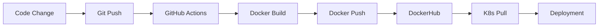

# Docker Build & Push Strategy for FKS Multi-Repo

**Goal**: Consistent Docker image building and pushing across all FKS microservices to DockerHub (username: `nuniesmith`)

## 🎯 Tagging Strategy

### Standard Tags (All Repos)

```bash
# Latest (always points to main branch latest)
nuniesmith/fks_<service>:latest

# Version tags (semantic versioning)
nuniesmith/fks_<service>:v1.0.0
nuniesmith/fks_<service>:v1.0
nuniesmith/fks_<service>:v1

# Git commit short SHA
nuniesmith/fks_<service>:sha-abc1234
```

### Special Tags (fks_ai only)

```bash
# Multi-stage builds for different hardware
nuniesmith/fks_ai:cpu      # Default CPU-only build
nuniesmith/fks_ai:gpu      # CUDA 12.0+ GPU build
nuniesmith/fks_ai:arm64    # Raspberry Pi ARM64 build
nuniesmith/fks_ai:latest   # Alias for :cpu
```

## 📦 Dockerfile Templates

### Standard Service Dockerfile (fks_api, fks_app, fks_data, etc.)

```dockerfile
# Example: fks_api/Dockerfile
FROM python:3.12-slim

WORKDIR /app

# Install dependencies
COPY requirements.txt .
RUN pip install --no-cache-dir -r requirements.txt

# Copy application code
COPY src/ ./src/
COPY tests/ ./tests/

# Environment
ENV PYTHONPATH=/app
ENV PORT=8000

# Health check
HEALTHCHECK --interval=30s --timeout=5s --start-period=5s --retries=3 \
  CMD curl --fail http://localhost:8000/health || exit 1

# Run
CMD ["uvicorn", "src.main:app", "--host", "0.0.0.0", "--port", "8000"]
```

### Multi-Stage Dockerfile (fks_ai only)

```dockerfile
# fks_ai/Dockerfile
# ===== Stage 1: CPU Build (Base) =====
FROM python:3.12-slim AS base

WORKDIR /app

# Install system dependencies
RUN apt-get update && apt-get install -y \
    curl \
    && rm -rf /var/lib/apt/lists/*

# Install Python dependencies
COPY requirements.txt .
RUN pip install --no-cache-dir -r requirements.txt

# Copy application
COPY src/ ./src/
COPY tests/ ./tests/

ENV PYTHONPATH=/app
ENV GPU_ENABLED=false

HEALTHCHECK --interval=30s --timeout=5s CMD curl -f http://localhost:8000/health || exit 1

CMD ["uvicorn", "src.main:app", "--host", "0.0.0.0", "--port", "8000"]

# ===== Stage 2: GPU Build =====
FROM nvidia/cuda:12.0.0-runtime-ubuntu22.04 AS gpu

WORKDIR /app

# Install Python 3.12
RUN apt-get update && apt-get install -y \
    python3.12 \
    python3-pip \
    curl \
    && rm -rf /var/lib/apt/lists/*

# Install dependencies
COPY requirements.txt .
RUN pip3 install --no-cache-dir -r requirements.txt && \
    pip3 install torch --index-url https://download.pytorch.org/whl/cu121

# Copy application
COPY src/ ./src/
COPY tests/ ./tests/

ENV PYTHONPATH=/app
ENV GPU_ENABLED=true

HEALTHCHECK --interval=30s --timeout=5s CMD curl -f http://localhost:8000/health || exit 1

CMD ["python3", "-m", "uvicorn", "src.main:app", "--host", "0.0.0.0", "--port", "8000"]
```

### Django Web Service (fks_web)

```dockerfile
# fks_web/Dockerfile
FROM python:3.12-slim

WORKDIR /app

# Install system dependencies
RUN apt-get update && apt-get install -y \
    postgresql-client \
    curl \
    && rm -rf /var/lib/apt/lists/*

# Install Python dependencies
COPY requirements.txt .
RUN pip install --no-cache-dir -r requirements.txt

# Copy Django app
COPY manage.py .
COPY src/ ./src/
COPY static/ ./static/
COPY templates/ ./templates/

ENV PYTHONPATH=/app
ENV DJANGO_SETTINGS_MODULE=src.settings

# Collect static files
RUN python manage.py collectstatic --noinput

HEALTHCHECK --interval=30s --timeout=5s CMD curl -f http://localhost:8000/health || exit 1

CMD ["gunicorn", "src.wsgi:application", "--bind", "0.0.0.0:8000", "--workers", "4"]
```

## 🚀 Build Commands

### Local Build and Push (Manual)

```bash
# Standard service (e.g., fks_api)
cd fks_api
docker build -t nuniesmith/fks_api:latest .
docker tag nuniesmith/fks_api:latest nuniesmith/fks_api:v1.0.0
docker push nuniesmith/fks_api:latest
docker push nuniesmith/fks_api:v1.0.0

# Multi-stage build (fks_ai)
cd fks_ai

# CPU build
docker build --target base -t nuniesmith/fks_ai:cpu .
docker tag nuniesmith/fks_ai:cpu nuniesmith/fks_ai:latest
docker push nuniesmith/fks_ai:cpu
docker push nuniesmith/fks_ai:latest

# GPU build
docker build --target gpu -t nuniesmith/fks_ai:gpu .
docker push nuniesmith/fks_ai:gpu

# ARM64 build (for Raspberry Pi)
docker buildx build --platform linux/arm64 \
  --target base \
  -t nuniesmith/fks_ai:arm64 \
  --push .
```

### Multi-Platform Builds (Advanced)

```bash
# Setup buildx (one-time)
docker buildx create --name multiplatform --use
docker buildx inspect --bootstrap

# Build for multiple architectures
docker buildx build \
  --platform linux/amd64,linux/arm64 \
  -t nuniesmith/fks_api:latest \
  --push .
```

## 🔐 DockerHub Authentication

### Local Setup

```bash
# Login to DockerHub
docker login -u nuniesmith
# Enter password when prompted

# Store credentials (optional, for automation)
echo "$DOCKERHUB_TOKEN" | docker login -u nuniesmith --password-stdin
```

### GitHub Actions Setup

Add secrets to **each repository**:

1. Go to repo → Settings → Secrets and variables → Actions
2. Click "New repository secret"
3. Add:
   - Name: `DOCKER_USERNAME`, Value: `nuniesmith`
   - Name: `DOCKER_PASSWORD`, Value: `<your-dockerhub-token>`

**Generate token**: DockerHub → Account Settings → Security → New Access Token

## 📝 .dockerignore

Create in each repo:

```gitignore
# .dockerignore
.git/
.github/
.vscode/
__pycache__/
*.pyc
*.pyo
*.pyd
.Python
.pytest_cache/
.mypy_cache/
.coverage
htmlcov/
dist/
build/
*.egg-info/
.env
.env.*
node_modules/
*.log
*.md
!README.md
docs/
tests/
*.test.js
```

## 🧪 Testing Docker Images

```bash
# Run locally
docker run -p 8000:8000 nuniesmith/fks_api:latest

# Test health endpoint
curl http://localhost:8000/health

# Check logs
docker logs <container-id>

# Exec into container
docker exec -it <container-id> /bin/bash
```

## 🔄 Image Update Workflow



## 📊 Image Size Optimization

### Best Practices

```dockerfile
# ✅ Good: Multi-stage build
FROM python:3.12-slim AS builder
RUN pip install --no-cache-dir -r requirements.txt
FROM python:3.12-slim
COPY --from=builder /usr/local/lib/python3.12/site-packages /usr/local/lib/python3.12/site-packages

# ✅ Good: Clean up in same RUN layer
RUN apt-get update && apt-get install -y curl \
    && apt-get clean \
    && rm -rf /var/lib/apt/lists/*

# ❌ Bad: Separate layers increase size
RUN apt-get update
RUN apt-get install -y curl
RUN apt-get clean

# ✅ Good: Use .dockerignore
# Excludes tests, docs, etc.

# ❌ Bad: COPY everything
COPY . .
```

### Size Targets

| Service | Target Size | Current Size |
|---------|-------------|--------------|
| fks_api | <500MB | TBD |
| fks_app | <500MB | TBD |
| fks_data | <600MB | TBD |
| fks_ai (CPU) | <2GB | TBD |
| fks_ai (GPU) | <5GB | TBD |
| fks_web | <800MB | TBD |
| fks_execution | <500MB | TBD |

## 🎯 Next Steps

1. ✅ Add Dockerfile to each repo (use templates above)
2. ✅ Add .dockerignore to each repo
3. ✅ Add DockerHub secrets to all GitHub repos
4. ✅ Create GitHub Actions workflows (see [03-github-actions.md](./03-github-actions.md))
5. ✅ Test local builds before enabling automation
6. ✅ Monitor image sizes and optimize

## 🔗 References

- [GitHub Actions for Docker](./03-github-actions.md)
- [Kubernetes Deployment](./01-core-architecture.md)
- [Docker Best Practices](https://docs.docker.com/develop/dev-best-practices/)
